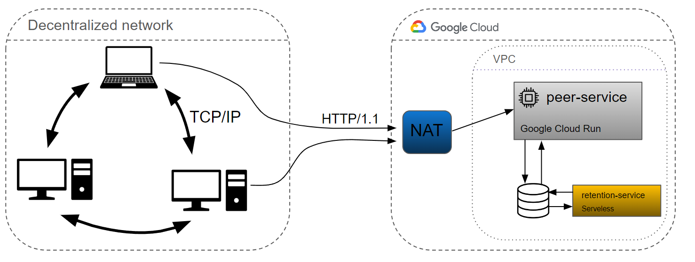

## Decentralized Machine Learning Client

> This client was done as final assignment for Distributed System course in University of Oulu. You can view the final report including small analysis here.



### About this repo

* ```./client``` contains the client with network connection / training logic
* ```./ui ``` contains the code for user interface
* ```./peer-service ``` contains the code for tracker

### Running the client
> ⚠️ **Warning:** To enable peer-to-peer connections, port forwarding or other firewall rules have to be applied for the client networking port (default=3002).


Prerequisite:
* docker


```
in project root:
docker-compose up

After the containers are up, client can be accessed from http://localhost:3000
```
